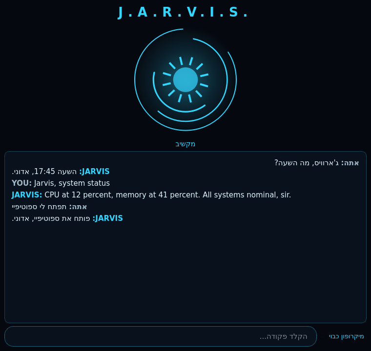

# J.A.R.V.I.S.

A bilingual (Hebrew 🇮🇱 / English) voice assistant for Windows, modelled on Tony Stark's JARVIS:
an always-listening wake word, a spoken butler persona, a glowing arc-reactor HUD, real control over
your PC, and a local language model so nothing leaves your machine.

> קובץ הוראות בעברית: [README.he.md](README.he.md)



## What it does

| | |
|---|---|
| **Wake word** | Say "Jarvis" or "ג'ארוויס" - then just talk. JARVIS stays awake for a follow-up conversation and goes back to standby on its own. |
| **Two languages** | Every phrase is recognised and answered in Hebrew *or* English. It replies in the language you used - and switches mid-conversation. |
| **Voice** | Microsoft neural voices (`he-IL-AvriNeural`, `en-GB-RyanNeural`) - free, no API key. Falls back to offline Windows SAPI voices. |
| **Brain** | Local & free through [Ollama](https://ollama.com), or OpenAI / Anthropic if you prefer. |
| **Control** | Open apps and sites, web & YouTube search, volume, screenshots, lock / restart / shutdown, system diagnostics, notes, timers, weather, time & date. |
| **HUD** | A PyQt6 window with an animated arc reactor that reacts to each state, plus a bilingual RTL-aware transcript and a text box for when you can't speak. |

## Install (Windows)

```powershell
git clone <this repo> jarvis
cd jarvis
powershell -ExecutionPolicy Bypass -File install_windows.ps1
```

The installer creates a virtual environment, installs the dependencies, copies `config.example.yaml`
to `config.yaml` and pulls the default Ollama model if Ollama is installed.

For conversation (not just commands) install the local model once:

```powershell
winget install Ollama.Ollama
ollama pull llama3.1:8b
```

Then start it:

```bat
run_jarvis.bat
```

Useful flags: `run_jarvis.bat --cli` (console), `--no-voice` (text only), `--mute` (no speech),
`python -m jarvis --list-mics` (pick a microphone), `python -m jarvis --say "מה השעה"` (one-shot).

Want a single executable? `powershell -ExecutionPolicy Bypass -File build_exe.ps1` → `dist\Jarvis\Jarvis.exe`.

## Talking to it

| Hebrew | English |
|---|---|
| "ג'ארוויס, מה השעה?" | "Jarvis, what time is it?" |
| "ג'ארוויס תפתח לי ספוטיפיי" | "Jarvis, open Spotify" |
| "תחפש חליפת איירון מן" | "Search for the Mark 42 suit" |
| "מזג האוויר בתל אביב" | "What's the weather in Haifa?" |
| "תוריד את הווליום" / "ווליום 40" | "Volume 40" / "mute" |
| "תצלם מסך" | "Take a screenshot" |
| "טיימר ל-10 דקות" | "Set a timer for 10 minutes" |
| "תרשום שצריך לקנות חלב" | "Note that the reactor needs a new core" |
| "מצב המערכת" | "System status" |
| "תנעל את המחשב" | "Lock the computer" |
| "לך לישון" | "Go to sleep" (standby) |
| "כבה את ג'ארוויס" | "Power down" |

Anything that is not a command becomes a conversation with the language model, answered in the
JARVIS persona and in your language.

## Configuration

Everything lives in `config.yaml` (see `config.example.yaml` for the annotated version):
wake words, speech engine, voices and speed, the model provider, your own app shortcuts,
the weather location and the HUD accent colour.

Switching brains is one line:

```yaml
brain:
  provider: "openai"   # ollama | openai | anthropic | offline
```

`openai` / `anthropic` read their key from the `OPENAI_API_KEY` / `ANTHROPIC_API_KEY` environment variables.

## How it works

```
microphone → SpeechRecognition ──► he-IL decode ┐
                                   en-US decode ┘ → confidence + script scoring → text + language
        ↓
wake word ("jarvis" / "ג'ארוויס")
        ↓
router →  1. phrase patterns (instant, offline, both languages)
          2. language-model routing into the same skill catalog
          3. free conversation with the JARVIS persona
        ↓
edge-tts neural voice  +  arc-reactor HUD
```

## Development

```bash
python -m venv .venv && .venv/bin/pip install -r requirements-dev.txt && .venv/bin/pip install -e .
.venv/bin/python -m pytest -q
.venv/bin/ruff check .
```

The core (language detection, wake word, skills, router) is pure Python and tested without any
audio hardware, so the suite runs anywhere - only the microphone, speakers and HUD need Windows.
